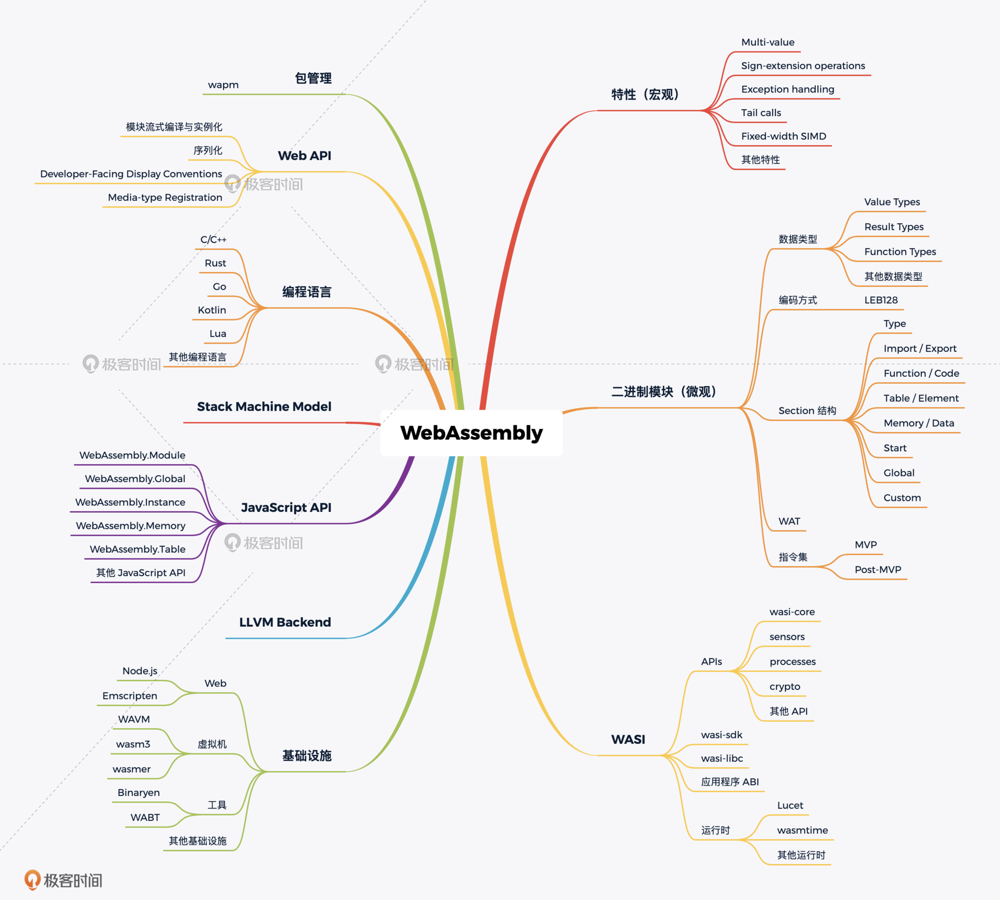
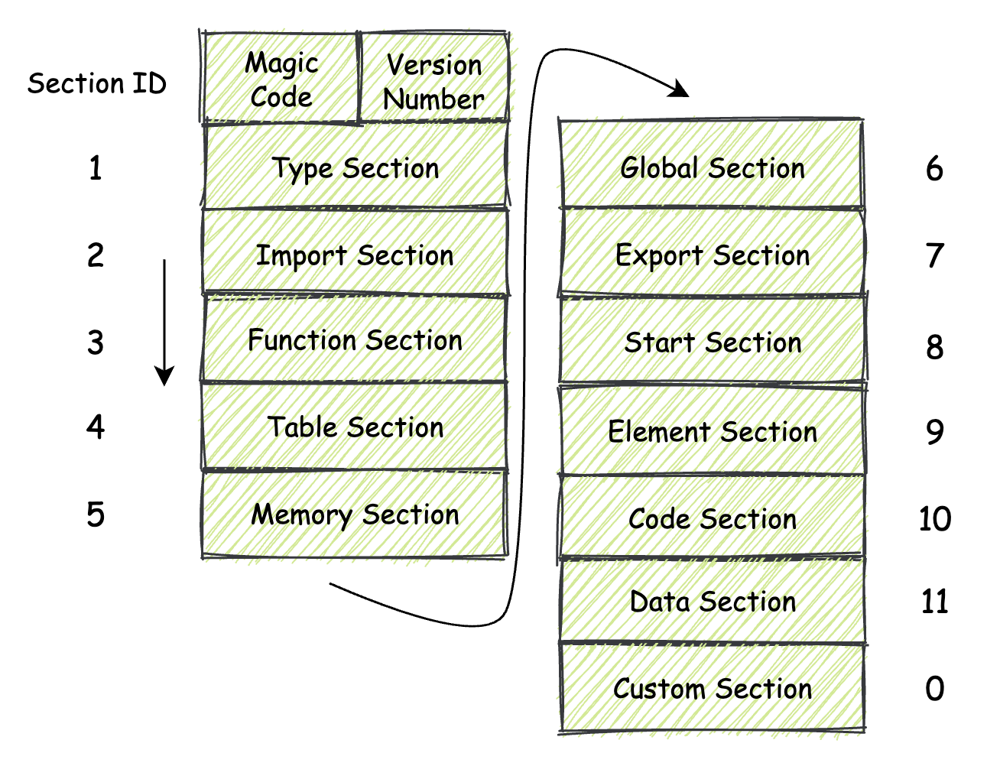
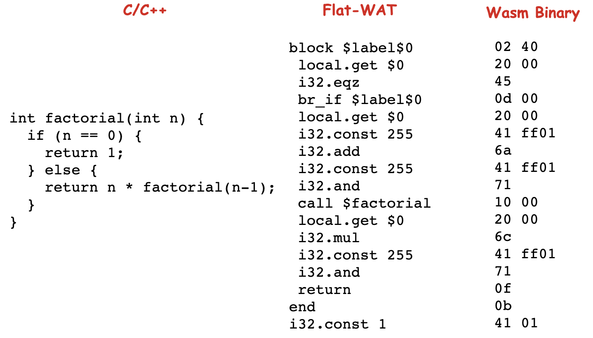
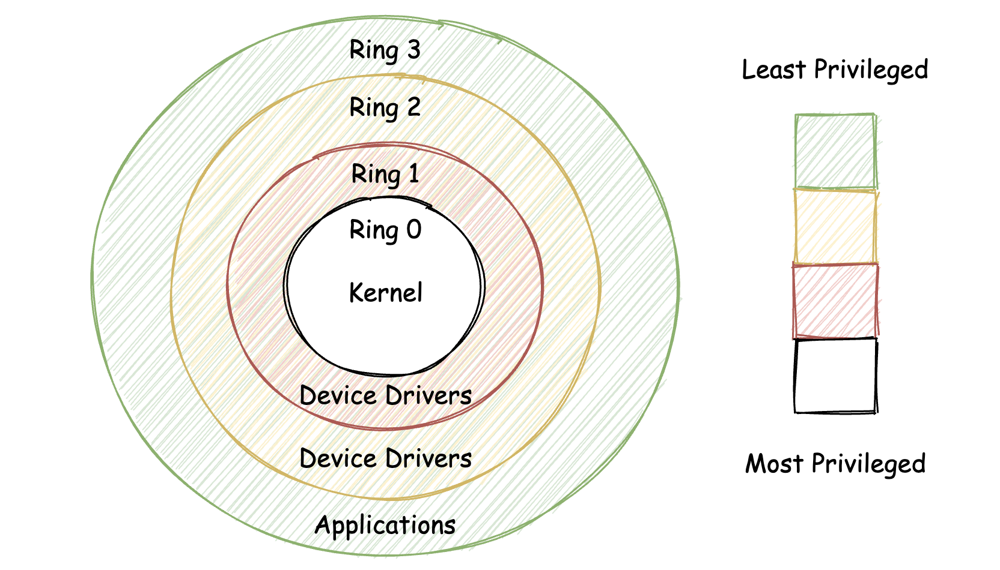
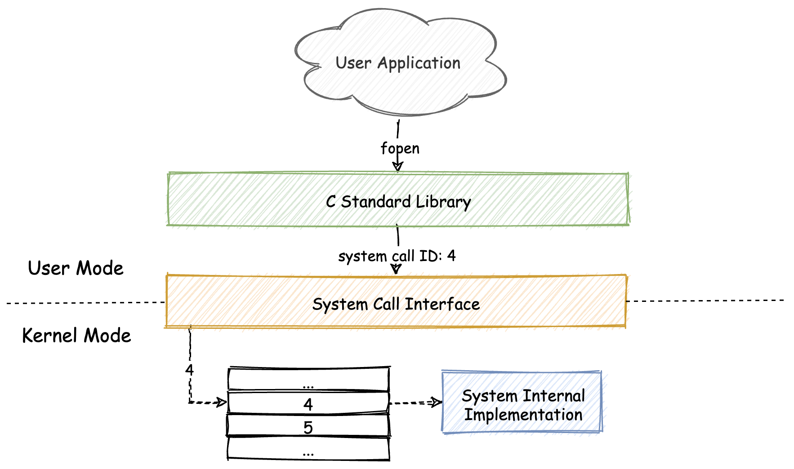
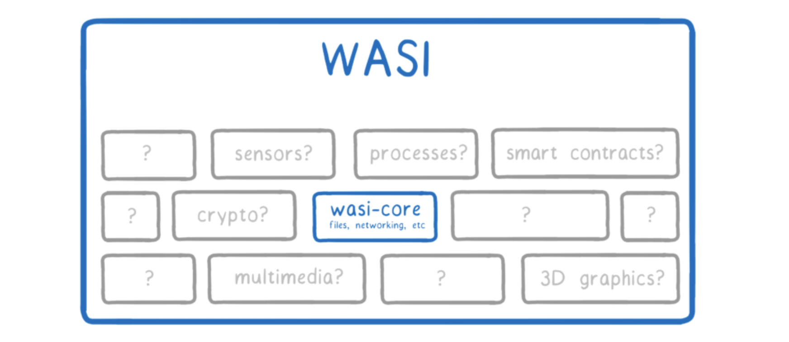
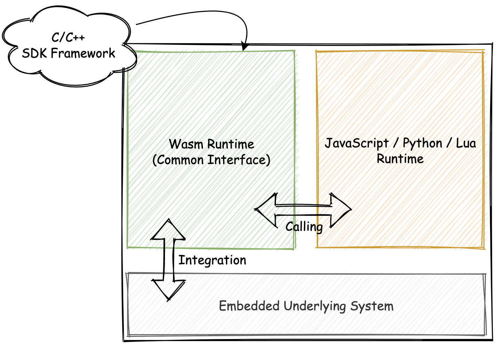
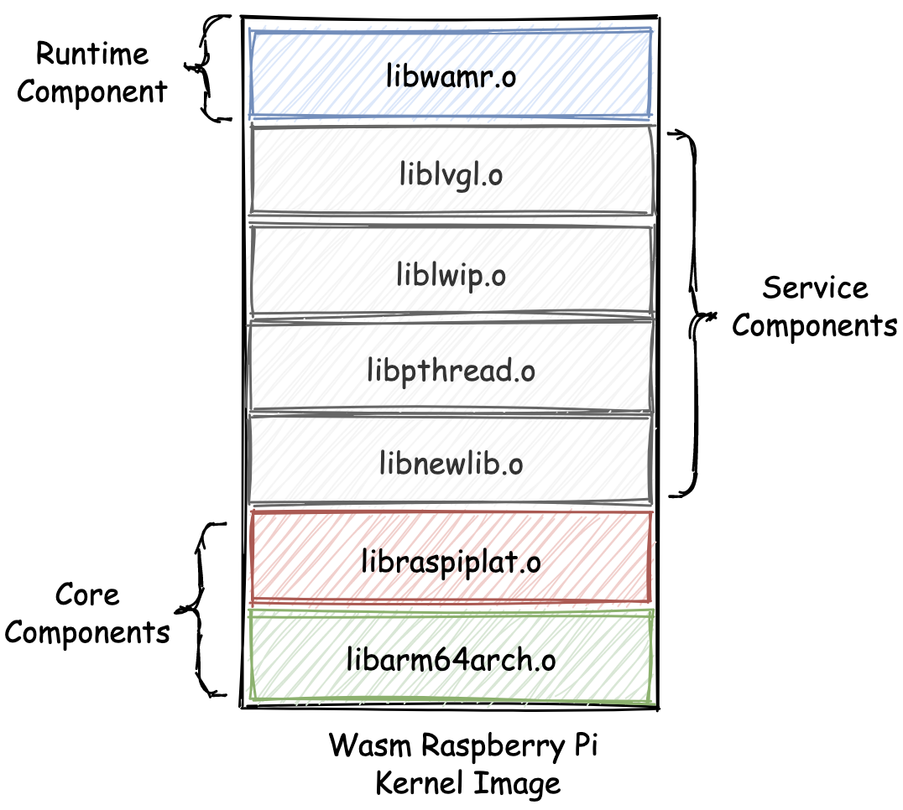
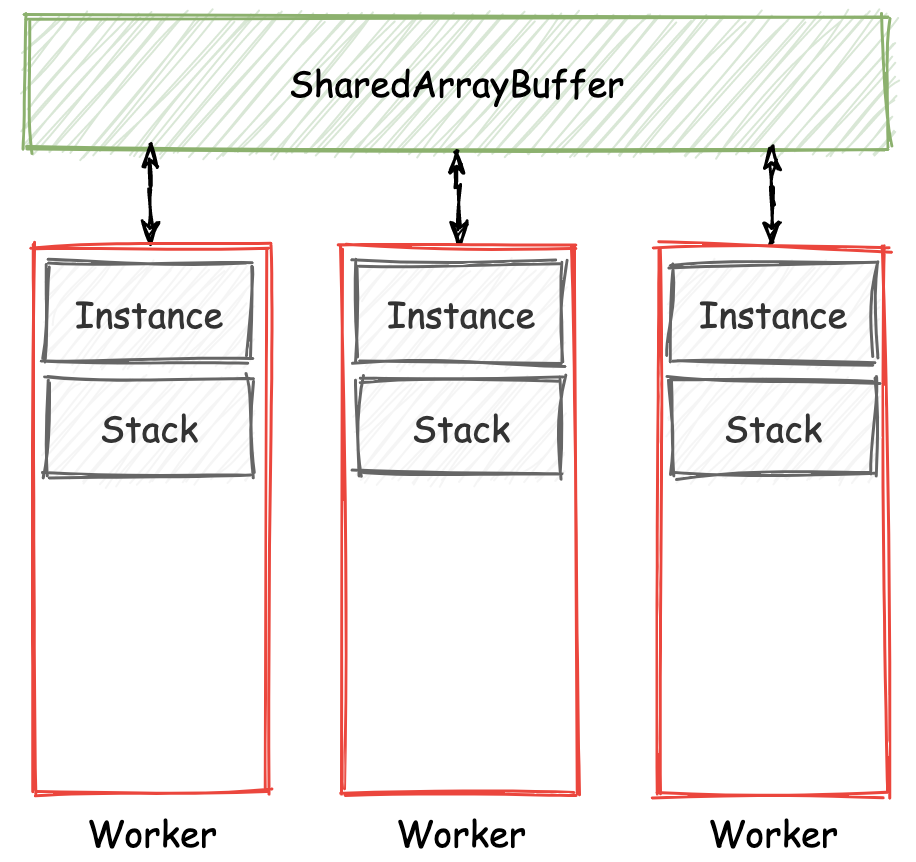
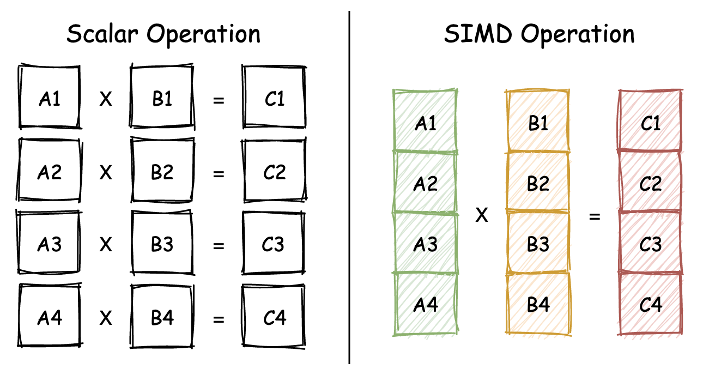

# webassemlby入门课  

## 一 课前必读  

### 1 我们为什么了解Webassmebly  

定义：  WebAssembly 是基于栈式虚拟机的虚拟二进制指令集（V-ISA），它被设计为高级编程语言的可移植编译目标  

Wasm 的出现更能够让我们直接在 Web 平台上，使用那些业界已存在许久的众多优秀的 C/C++ 代码库  

2017 年 8 月，W3C WebAssembly Working Group 成立，意味着 WebAssembly 正式成为 W3C 众多技术标准中的一员。  
wasm介绍：
Wasm 的历史和起源；  
Wasm 采用的计算模型和体系结构；  
Wasm 模块的内部结构；  
Wasm 相关的实战和应用。  

目录:  



### 2  基础篇：学习此课程你需要了解哪些基础知识？  
跳过  


### 3  历史篇：为什么会有 WebAssembly 这样一门技术？  

js是弱类型语言，也可以称为解释型语言，执行效率较低，尽管拥有jit优化，不过如果编写者不按照jit优化方式去编写代码，jit是不会生效的。所以导致js语言执行效率较低。  

在wasm之前有很多提高js性能的方案，其中包括NACI和PNACI，但是都由于架构设计和技术局限性导致落地难度大。  

除了 NaCl 与 PNaCl，另一个不可不提的技术便是 Mozilla 于 2013 提出的 ASM.js。同前两者一样，ASM.js 的设计目标也是为了能够在 JavaScript 语言之外，为“构建更高性能的 Web 应用”这个目标，提供另外一种实现的可能。  

asm.js  
- 1. 是js子集，可以视为普通js来执行，拥有良好的兼容性  
- 2. 通过注解的方式标记asm.js代码，当满足一定条件时，浏览器通过注解识别到是asm.js进而直接编译成机器码，当再次执行时直接执行编译好的机器码。  

demo 
```
function asm (stdin, foreign, heap) {
  // 注解
  "use asm";
  function add (x, y) {
    x = x|0; // 变量 x 存储了 int 类型值；
    y = y|0; // 变量 y 存储了 int 类型值；
    var addend = 1.0, sum = 0.0; // 变量 addend 和 sum 默认存放了"双精度浮点"类型值；
    sum = sum + x + y; return +sum; // 函数返回值为"双精度浮点"类型；
  }
  return { add: add };
}
```  

## 二 核心原理篇  

### 1. wasm是一门新语言吗？  

“WebAssembly（缩写为 Wasm）是一种基于堆栈式虚拟机的二进制指令集。Wasm 被设计成为一种编程语言的可移植编译目标，并且可以通过将其部署在 Web 平台上，以便为**客户端及服务端应用程序提供服务**”。这是 Wasm 官网给出的一段，对 “Wasm 是什么？” 这个问题的解答。


常见计算机**计算模型**：
- 1. 堆栈机模型（现在常用）：先进后出
- 2. 寄存器机模型
- 3. 累加器机模型

ISA和V-ISA  

通常来说，对于可以应用在诸如 i386、X86-64 等实际存在的物理系统架构上的指令集，我们一般称之为 ISA（Instruction Set Architecture，指令集架构）。而对另外一种使用在虚拟架构体系中的指令集，我们通常称之为 V-ISA，也就是 Virtual（虚拟）的 ISA。  

对这些 V-ISA 的设计，大多都是基于堆栈机模型进行的。而 Wasm 就是这样的一种 V-ISA。

Wasm 之所以会选择堆栈机模型来进行指令的设计，其主要原因是由于堆栈机本身的设计与实现较为简单。快速的原型实现可以为 Wasm 的未来发展预先试错。  

wasm指令集：

```
i32.const 1
i32.const 2
i32.add
```

另外要提到的是，类比汇编语言与机器码。这里我们看到的诸如 “i32.const” 与 “i32.add” ，其实都是 Wasm 这个 V-ISA 指令集中，各个指令所对应的文本助记符（mnemonic）。实际当这些助记符被编译到 Wasm 二进制模块中时，会使用助记符所对应的二进制字节码（一般被称为 OpCode，你可以简单地将其理解为一些二进制数字），并配合一些编码算法来压缩整个二进制模块文件的体积。  

**Wasm 被设计成为一种编程语言的可移植编译目标**: 这句话意思是他只是一个目标并不是让你去编写，而是有编译器来将c/c++直接编译成wasm

### 2. WebAssembly 模块的基本组成结构到底有多简单？  

wasm真面目：section  

section  

从整体上来看，同 **ELF 二进制文件类似**，Wasm 模块的二进制数据也是以 Section 的形式被安排和存放的。Section 翻译成中文是“段”，但为了保证讲解的严谨性，以及你在理解上的准确性，后文我会直接使用它的英文名词 Section。  

对于 Section，你可以直接把它想象成，一个个**具有特定功能的一簇二进制数据**。通常，为了能够更好地组织模块内的二进制数据，我们需要把具有相同功能，或者相关联的那部分二进制数据摆放到一起。而这些被摆放在一起，具有一定相关性的数据，便组成了一个个 Section。  



换句话说，每一个不同的 Section 都描述了关于这个 Wasm 模块的一部分信息。而模块内的所有 Section 放在一起，便描述了整个模块在二进制层面的组成结构。在一个标准的 Wasm 模块内，以现阶段的 MVP 标准为参考，可用的 Section 有如下几种。
- 1. Type Section
- 2. Start Section
- 3. Global Section
- 4. Custom Section
- 5. 互补 Section
- 6. Import Section 和 Export Section
- 7. Function Section 和 Code Section
- 8. Table Section 和 Element Section
- 9. Memory Section 和 Data Section

为了识别一段二进制文件是wasm文件，我们通过魔数进行识别。
魔数：其实同 ELF 二进制文件一样，Wasm 也同样使用“魔数”来标记其二进制文件类型。所谓魔数，你可以简单地将它理解为具有特定含义 / 功能的一串数字。
一个标准 Wasm 二进制模块文件的头部数据是由具有特殊含义的字节组成的。其中开头的前四个字节分别为  “（高地址）0x6d 0x73 0x61 0x0（低地址）”，这四个字节对应的 ASCII 可见字符为 “asm”（第一个为空字符，不可见）。  

接下来的四个字节，用来表示当前 Wasm 二进制文件所使用的 Wasm 标准版本号。就目前来说，所有 Wasm 模块该四个字节的值均为 “（高地址）0x0 0x0 0x0 0x1（低地址）”，即表示版本 1。在实际解析执行 Wasm 模块文件时，VM 也会通过这几个字节来判断，当前正在解析的二进制文件是否是一个合法的 Wasm 二进制模块文件。

### 3. WebAssembly 微观世界的基本数据规则是什么？  
本节主要介绍wasm编码方式以及一些常用的编码  
LSB：最低有效位  
MSG：最高有效位  
大端模式（LSB存在物理地址高位）与小端模式（LSB存在物理地址低位）  
编码
- 1. LEB-128 整数编码
- 2. Unsigned LEB-128
- 3. Signed LEB-128
- 4. IEEE-754 浮点数编码
- 5. UTF-8 字符串编码    

介绍了字符串，数字，浮点数等编码方式

### 4. 如何让一个 WebAssembly 二进制模块的内容易于解读？  

wat：WAT 的全称 “WebAssembly Text Format”，我们一般称其为 “WebAssembly 可读文本格式”。它是一种与 Wasm 字节码格式完全等价，可用于编码 Wasm 模块及其相关定义的文本格式。  

这种格式使用 “S- 表达式” 的形式来表达 Wasm 模块及其定义，将组成模块各部分的字节码用一种更加线性的、可读的方式进行表达。这种表达式可以被wasm编译工具直接使用。

S-表达式  

例如，lisp语言  

```
(print 
 (* 2 (+ 3 4))
)
```  
这就是一种s-表达式  

wasm的wat表达式：  

```

(func $factorial (; 0 ;) (param $0 i32) (result i32)
 (local $1 i32)
 (local $2 i32)
 (block $label$0
  (br_if $label$0
   (i32.eqz
    (get_local $0)
   )
  )
  (set_local $2
   (i32.const 1)
  )
  (loop $label$1
   (set_local $2
    (i32.mul
     (get_local $0)
     (get_local $2)
    )
   )
   (set_local $0
    (tee_local $1
     (i32.add
      (get_local $0)
      (i32.const -1)
     )
    )
   )
   (br_if $label$1
    (get_local $1)
   )
  )
  (return
   (get_local $2)
  )
 )
 (i32.const 1)
)
```

flat-wat: 为了能够让你更加直观地看清楚从源代码、Wasm 字节码再到 WAT 三者之间的对应关系，首先我们要做的第一件事就是将对应的 WAT 代码 “拍平（flatten）”，将其变成 “Flat-WAT”。 
wat->flat-wat: “拍平”的过程十分简单。正常在通过 “S- 表达式” 形式表达的 WAT 代码中，我们通过“嵌套”与“小括号”的方式指定了各个表达式的求值顺序。而 “拍平” 的过程就是将这些嵌套以及括号结构去掉，以“从上到下”的先后顺序，来表达整个程序的执行流程。

```

(func $factorial (param $0 i32) (result i32)
 block $label$0
  local.get $0
  i32.eqz
  br_if $label$0
  local.get $0
  i32.const 255
  i32.add
  i32.const 255
  i32.and
  call $factorial
  local.get $0
  i32.mul
  i32.const 255
  i32.and
  return
 end
 i32.const 1)
```

对应关系:  



wat工具：  

- 1. wasm2wat
- 2. wat2wasm
- 3. wat-desugar：wat->flat-wat

### 5. WASI：你听说过 WebAssembly 操作系统接口吗？  

wasi: WASI（WebAssembly System Interface，Wasm 操作系统接口）  

本节主要介绍out-of-web环境下的wasm+wasi

安全模型  
- 1. 分级保护域
- 2. Capability-based Security  

分级保护域  
基于“分级保护域”实现的安全模型，被广泛应用于类 Unix 的各类操作系统中，比如下图所示的操作系统 Ring0 层和 Ring3 层（Ring1 / Ring2 一般不会被使用）便是“分级保护域”的一种具体实现形式。 



在传统意义上，Ring0 层拥有着最高权限，一般用于内核模式；而 Ring3 层的权限则会被稍加限制，一般用于运行用户程序。当一个运行在 Ring3 层的用户程序，试图去调用只有 Ring0 层进程才有权限使用的指令时，操作系统会阻止调用。这就是“分级保护域”的大致概念。 

Capability-based Security  
在具有 capability 概念的操作系统中，只要用户程序拥有了这个 capability，那它就拥有足够的权限去访问对应的资源。从理论上来讲，基于 Capability-based Security 的操作系统，甚至不需要如“权限控制列表（ACL）”这类的传统权限控制机制。

系统调用（System Call）  



WebAssembly 操作系统接口（WASI）  


WASI 在 Wasm 字节码与虚拟机之间，增加了一层“系统调用抽象层”。比如对于在 C/C++ 源码中使用的 fopen 函数，当我们将这部分源代码与专为 WASI 实现的 C 标准库 “wasi-libc” 进行编译时，源码中对 fopen 的函数调用过程，其内部会间接通过调用名为 “__wasi_path_open” 的函数来实现。这个 __wasi_path_open函数，便是对实际系统调用的一个抽象。  



### 5. API：在 WebAssembly MVP 标准下你能做到哪些事？  

主要讲解wasm调用，一般胶水代码替我们做好了这些事  

## 三 应用篇 

### 1. WebAssembly 能够为 Web 前端框架赋能吗？  

Rust语言： Yew 框架  
Ember.js  

跳过  

### 2. WebAssembly 在物联网、多媒体与云技术方面有哪些创新实践？

统一的编程接口  

嵌入式开发一开始只能c/c++或者汇编进行开发，wasm和wasi提供了一种新的高级语言js，lua运行在IoT上的方式。结构设计如下：  



微内核 - Unikernel  

传统的内核大而全，实际上我们在特定场景下，不需要那么多功能，是否可以只把整个嵌入式硬件需要使用的内核底层组件单独提取出来，使其成为一个面向某一类特定功能或应用的专有内核呢？答案是当然可以，这就是“微内核”的概念。  

相较于传统的类 Unix 操作系统内核（一般称之为宏内核），微内核有着许多的优势，比如：更快的启动速度、更小的 ROM 体积，以及更高的硬件资源使用率。 Unikraft 便是这样一款可以用来制作微内核的系统工具。  

相较于其他基于 JavaScript 等高级编程语言运行时（比如 V8）构建的微内核而言，基于 Wasm 的微内核将有着更高的程序执行效率、更少的硬件资源占用率，以及更快的操作系统冷启动速度。这都是源自于 Wasm 本身作为一种 V-ISA 所带来的优势。  
架构：  
  

多媒体（Multimedia）  

音视频编解码(openh264.h, aac.h, opus.h....)  

<a href="https://github.com/brion/ogv.js">ogv.js</a>  值得借鉴播放器架构设计以及使用wasm在音视频领域。  

WXInlinePlayer  

<a href="https://github.com/this-spring/WXInlinePlayer">WXInlinePlayer</a>

实现AudioContext和Canvas播放音频和视频


Embly  

Embly 是一个基于 Wasm 的 Severless 框架  

Krustlet  

Kubernetes 是目前云原生领域中，最常用的一种容器编排引擎。Kubernetes 由 Google 开源，通过它我们可以方便地管理云平台上众多物理主机中运行的容器化应用。Kubernetes 使容器化应用的部署和管理变得更加简单和高效。  

### 3. 有哪些优秀的 WebAssembly 编译器与运行时？  

虚拟机运行时(Wasm 运行时（虚拟机）、Wasm 运行时组件（实现）以及 Wasm 语言相关的工具。)  

Wasmtime  

除此之外，Wasmtime 还支持部分的 WASI 系统接口以及 Wasm Post-MVP 提案，以及对于诸如 C 和 Python 等语言的运行时绑定。这样你便可以在这些语言的代码中，直接使用 Wasmtime 所提供的能力。关于它的更多信息可以在这里查看。<a href="https://wasmtime.dev/">wasmtime</a>


WAMR  

WAMR 支持多种 Wasm 字节码的运行时“翻译”模式，比如 JIT 模式、AOT 模式以及解释器模式。其中在解释器模式下，整个运行时的大小仅有 85KB。在 AOT 模式下，仅有 50KB。不仅如此，它可以在将近 100 微秒的时间内启动应用，并在最小 100KB 的内存资源下，便可以启动一个 Wasm 实例。

<a href="https://github.com/bytecodealliance/wasm-micro-runtime">wamr</a>  

Wasmer  

不同于 Wasmtime 与 WAMR，Wasmer 基于 Rust 编写，它在支持 Wasm 核心标准、部分 WASI 系统接口以及部分 Wasm Post-MVP 标准的基础之上，还同时提供了对多达数十种编程语言的 Wasm 运行时绑定支持。这意味着，你可以在其他编程语言中使用 Wasmer 的能力来解析和执行 Wasm 字节码。

wasmer有一个很有趣的尝试， Wasmer 同时提供和维护 Wasm 包管理平台 —— Wapm。通过这个平台，你可以发布新的或直接使用已有的 Wasm 包。这些包都借助于 WASI 抽象操作系统接口，提供了与本地应用相同的系统资源访问能力。

<a href="https://wasmer.io/">wasmer</a>  

### 4. LLVM：如何将自定义的语言编译到 WebAssembly？  

跳过  

### 5. 有哪些正在行进中的 WebAssembly Post-MVP 提案？  

多线程与原子操作   


SIMD   

Single Instruction, Multiple Data：单指令多数据（一条指令同时操作多条数据）



Wasm64  

使用 32 位长度的“偏移地址”，来访问 Wasm 模块线性内存中某个位置上的数据。最大使用内存是2的32次方，也就是4G，wasm64增加了使用内存大小。  

Wasm ES Module  

例子:  

```
import { add } from "./util.wasm";
console.log(add(1, 2)); // 3;
```  

Interface Type  

该提案通过在宿主环境与 Wasm 模块之间添加“接口适配层”，来满足从 Wasm 模块的“低层次”数据类型，到外界宿主环境“高层次”数据类型之间的相互转换过程。借助于这个提案，Wasm 模块与宿主环境之间的可交换数据类型将会变得更加丰富，同时数据的交换成本也会变得更低。  

