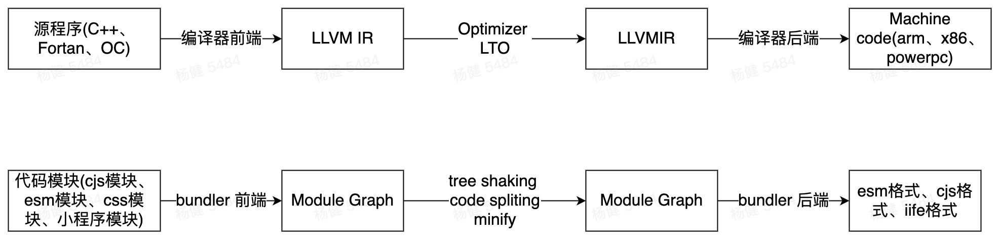

<!--
 * @Author: xiuquanxu
 * @Company: kaochong
 * @Date: 2021-03-28 22:16:32
 * @LastEditors: xiuquanxu
 * @LastEditTime: 2021-03-29 00:23:42
-->
## 编译器简介  
传统的静态编译器分为三个阶段：前端、中端（优化）、后端。

## LLVM架构简介  
而大名鼎鼎的GCC编译器在设计的时候没有做好层次划分，导致很多数据在前端和后端耦合在了一起，所以GCC支持一种新的编程语言或新的目标架构特别困难。

这样支持一种新的编程语言只需重新实现一个前端，支持一种新的目标架构只需重新实现一个后端，前端和后端连接枢纽就是LLVM IR。

LLVM IR本质上一种与源编程语言和目标机器架构无关的通用中间表示，是LLVM项目的核心设计和最大的优势。

LLVM IR是一种类似于RISC的低级虚拟指令集

这种设计同wasm（前端clang/llvm->wasm->wasm后端）

  

## bunlder

bunlder: bunlder工作就是将一系列通过模块方式组织的代码将其打包成一个或者多个文件。常见是webpack、rollup、esbuild。  

工作原理  
