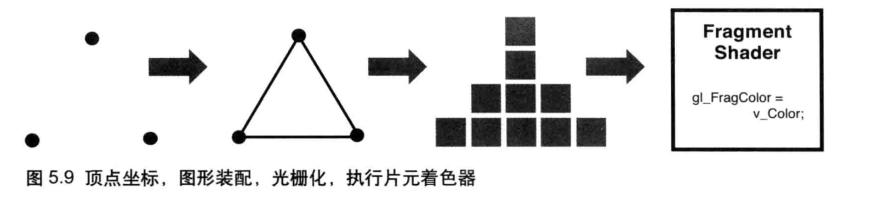
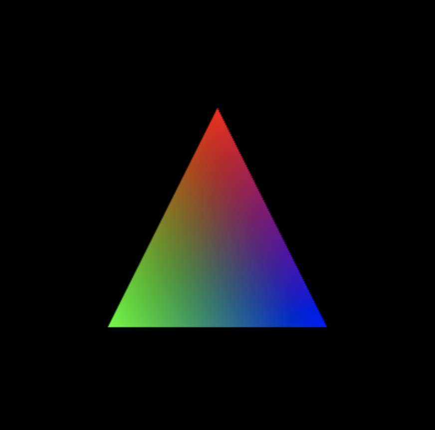
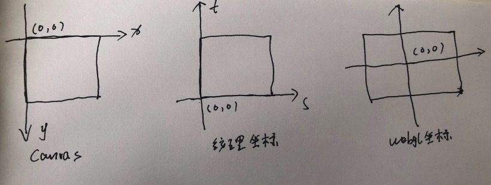

<!--
 * @Author: xiuquanxu
 * @Company: kaochong
 * @Date: 2021-01-11 11:46:47
 * @LastEditors: xiuquanxu
 * @LastEditTime: 2021-03-31 23:26:08
-->

## 第二章  

### webgl的api  

mdn: https://developer.mozilla.org/zh-CN/docs/Web/API/WebGLRenderingContext/drawArrays

### gl.drawArrays()  

根据着色器画点、线、三角形

### webgl坐标系（右手系）

### gl.getAttribLocation(gl.program, 'a_Position')   
获取attribute变量的locatioin
找不到返回-1  

### gl.vertexAttrib3f('a_Position', 0.0, 0.0, 0.0)
给attribute变量进行赋值
1f、2f、3f....  

gl.vertexAttrib3fv(position, new Float32Array([1.0, 2.0, 3.0]))

虽然我们声明的是vec4但是我们传递的是3f这是因为webgl会自动帮我们补充一个1.0，对于齐次坐标系来说1.0加不加都可以，对于颜色来说1.0是不透明。  

返回值无(void)

### uniform变量  

只有顶点着色器可以使用attribute变量，片元着色器只能使用uniform变量或者varying变量  

### const u_Color = gl.getUniformLocation(gl.program, 'u_Color')  
获取uniform变量

返回值，如果存在则返回一个特殊值，如果不存在则返回null  

### gl.uniform4f(u_COlor, 1.0, 0.0, 0.0)
给uniform变量赋∏值
1f、2f、3f...同attribute变量  
uniform[1234][fi][v]()  

返回值void

## 第三章  

### 使用缓冲区对象  

缓冲区对象是给顶点着色器使用的  

### gl.createBuffer()  
创建缓冲区
返回值：  
返回一个用于存储顶点数据或着色数据的WebGLBuffer对象

### gl.deleteBuffer(buffer)  
删除参数buffer的缓存区对象
返回值：
null
### gl.bindBuffer(gl.ARRAY_BUFFER, vertexBuffer);  

返回值：  
none

### gl.bindData(gl.ARRAY_BUFFER, vertices, gl.STATIC_DRAW)  
绑定缓冲区

### gl.vertexAttribPointer(location, size, type, nomalized, stride, offset)  
该方法可以将整个缓冲区对象分配给attribute变量
location: attribute变量位置  
size: 每个顶点分量个数(若size币attribute变量小，确实分量将按照与gl.vertexAttib[1234]f()相同规则补全,比如size为1，那么2，3分量自动设置为0，4分量为1)  
type:  gl.FLOAT等类型  
normalize: 表明是否将非浮点型的数据诡异化到[0,1]或[-1,1]区间  
stride: 指定相邻两个顶点间的字节数默认为0  
offset：指定缓冲区对象中的偏移量，从第几个字节开始  

### gl.enableVertexAttribArray(location)  
开启attribute变量  

### gl.disableVertexAttribArray(locaction)  
关闭分配

### 平移  
直接在原来的基础点上加上需要平移的距离  
eg：  
```
vec4(原) + vec4(移动) = vec4(目标)  

shader:  
attribute vec4 a_Position;
uniform vec4 u_Translation;
void main() {
    gl_Position = a_Position + u_Translation;
}
```

### 旋转  
```
旋转：  
1. 旋转轴
2. 旋转方向
3. 旋转角度
```
旋转计算公式：  
```
x1 = x*cos@ - y*sin@;
y1 = x*sin@ + y*cos@;
z1 = z;
shader: 
attribute vec4 a_Position;
uniform float u_Cos;
uniform float u_Sin;
void main() {
    gl_Positioin.x = a_Position.x * u_Cos - a_Position.y * u_Sin;
    gl_Position.y = a_Position.x * u_Sin + a_Position * u_Cos;
    gl_Position.z = a_Position.z;
    gl_Positin.w = 1.0;
}
```

### 变换矩阵  
变换矩阵非常适合计算机图形学
矩阵 * 矢量 = 新的矢量  
```
[
    x1
    y1
    z1
]

=
[
    a b c,
    d e f,
    g h j,
]
*
[
    x
    y
    z
]
``` 

### 通过矩阵实现旋转  
```
实现方式为根据公式：  
x1 = x*cos@ - y*sin@;
y1 = x*sin@ + y*cos@;
z1 = z;
可知：  
[
    x1
    y1
    z1
    1
]
=
[
    cos@  -sin@ 0 0
    sin@  cos@  0 0
    0        0  1 0
    0        0  0 1
]
*
[
    x
    y
    z
    1
]
```
在通过矩阵进行变换时候有一个问题，那就是我们使用的TypeArray(Float32Array)是一维数组没有办法存储二维数组，因此我们采用主列序或者主行序存储。webgl中采用主列序进行存储。  

因此上面的数据存储为：  
```
var matrix = new Float32Array([
    cos@, sin@, 0, 0,
    0sin@, cos@, 0, 0,
    ...
    ...
])
```
### 通过矩阵进行平移  
```
根据公式：
x1 = x + Tx
y1 = y + Ty
z1 = z + Tz
1 = 1
可知：
var matrix = new Float32Array([
    1.0, 0.0, 0.0, 0.0,
    0.0, 1.0, 0.0, 0.0,
    0.0, 0.0, 1.0, 0.0,
    Tx, Ty, Tz, 1.0
])
```  

### 通过矩阵进行缩放  

```
根据公式：
x1 = x * Sx
y1 = y * Sy
z1 = z * Sz
可知：  
var matrix = new Float32Array([
    Sx, 0, 0, 0,
    0, Sy, 0, 0,
    0, 0, Sz, 0,
    0, 0, 0, 1
]);
```  

## 总结  
1. 熟悉webgl各种API。获取Attribute和Unifrom变量然后进行赋值。以及掌握使用顶点着色器的缓冲区。
2. 掌握了通过矩阵进行平移、旋转、变换操作。
3. 使用时候注意各种异常处理包括，getAttribLocation时候返回-1处理。
4. 通过平移等matrix编写shader即可实现平移等操作。

## 第四章  

### 基础知识  

矩阵计算：A矩阵是M\*N,B矩阵是N\*P,则A*B矩阵 = M\*P  

计算规则是第一个矩阵的列数要等于第二个矩阵的行数
```
[
    1, 0, 0, 1,
    0, 1, 0, 1,
    0, 0, 1, 1,
]
*
[
    Sx, 0, 0, 0,
    0, Sy, 0, 0,
    0, 0, Sz, 0,
    0, 0, 0, 1
]
=
[
    Sx, Sy, Sz, 1,
    .....
]
4x3 * 4x4 = 4x4
```

也就是说第一个矩阵的乘以第二个矩阵得到的结果一定是：第一个矩阵的行数*第二个矩阵的列数  

```

eg:
[
    1.0, 0.0, 0.0, 1.0,
]
```

## 第五章  

### gl.vertexAttribPointer
gl.vertexAttribPointer(location, size, type, normalized, stride, offset);
```
location: 指定待分配attribute变量位置  
size: 指定缓冲区中没给个顶点分量个数  
type: 指定数据格式，例如：gl.FLOAT
normalize: ture或false，是否将浮点数进行归一化  
stride: 指定相邻两个节点的字节数
offset: 指定缓冲区对象中的偏移量
```
举例：
```
<!-- 数据源信息 -->
var verticesColors = new Float32Array([
    0.0,  0.5,  1.0,  0.0,  0.0, 
    -0.5, -0.5,  0.0,  1.0,  0.0, 
    0.5, -0.5,  0.0,  0.0,  1.0, 
]);
如果数据源中每个顶点是5个数据，前两个代表坐标，后三个代表颜色，那么：
<!-- 坐标 -->
gl.vertexAttribPointer(a_Position, 2, gl.FLOAT, false, FSIZE * 5, 0);
<!-- 颜色 -->
gl.vertexAttribPointer(a_Color, 3, gl.FLOAT, false, FSIZE * 5, FSIZE * 2);
```

### webgl工作流程  

1. 编译顶点着色器和片元着色器
2. 顶点着色器进行图元装配
3. 光栅化（生成无数片元）
4. 片元着色器颜色内插
5. 片元着色器将颜色渲染到对应的片元上输出给颜色缓冲区
6. 显示器读取颜色缓冲区显示图像  

2-6步




### 内插  
先看一段代码:  
```
<!-- 顶点着色器 -->
var VSHADER_SOURCE = 
  'attribute vec4 a_Position;\n' +
  'attribute vec4 a_Color;\n' +
  'varying vec4 v_Color;\n' +
  'void main() {\n' +
  '  gl_Position = a_Position;\n' +
  '  v_Color = a_Color;\n' +
  '}\n';

<!-- 片元着色器 -->
var FSHADER_SOURCE = 
  'precision mediump float;\n' +
  'varying vec4 v_Color;\n' +
  'void main() {\n' +
  '  gl_FragColor = v_Color;\n' +
  '}\n';
<!-- 数据源信息 -->
var verticesColors = new Float32Array([
    0.0,  0.5,  1.0,  0.0,  0.0, 
    -0.5, -0.5,  0.0,  1.0,  0.0, 
    0.5, -0.5,  0.0,  0.0,  1.0, 
]);
<!-- 缓冲区赋值 -->
gl.vertexAttribPointer(a_Position, 2, gl.FLOAT, false, FSIZE * 5, 0);
gl.vertexAttribPointer(a_Color, 3, gl.FLOAT, false, FSIZE * 5, FSIZE * 2);
```
解读该代码通过创建一个缓冲区绑定数据verticesColors，然后分别分配给顶点着色器的a_Position和a_Color,顶点着色器中又将a_Color通过v_Color传递给片元着色器。三个顶点颜色分别是红、绿、蓝。最后渲染效果:  


问题：你会发现明明只有顶点有颜色，但是局部好像颜色均匀的平铺开了一样，这就是内插的作用。  

我们看一个简单例子：  
```
图元装配：
点A(红色(1,0,0))-------点B(蓝色(0,0,1)) 连成线 顶点着色器中
光栅化
片元A(红色(1,0,0))
片元B(内插颜色(0.9,0,0))
片元C(内插颜色(0.8,0,0))
片元D(内插颜色(0.7,0,0))
片元E(内插颜色(0.6,0,0))
片元F(内插颜色(0.5,0,0))
.....
片元...(内插颜色(0,0,1)) 片元着色器内插后的颜色
```
在这个例子中顶点着色器经过光栅化后，每个片元颜色会逐渐内插，这条线上的红色从1.0->0.0,蓝色从0.0->1.0,线段上所有片元的颜色值都会被恰当计算出来，这个过程就叫做内插。  

### 纹理相关概念  
纹理映射：将一个图像映射到一个几何图形表面上。  
纹理或纹理图像：被映射的图像就叫做纹理或者纹理图像  

### 坐标系相关  
canvas坐标系、纹理坐标系、webgl坐标系  


### webgl纹理相关Api  

#### gl.createTexture()  
创建纹理对象,纹理对象提供储存和状态等纹理操作  
返回值：  
null ： 创建失败  
non-null:创建成功  

#### gl.deleteTexture()  
删除纹理对象  
返回值: void 

#### gl.pixelStori(pname, param)  
用于图像预处理的函数  
```
eg:
gl.pixelStori(gl.UNPACK_FILP_Y_WEBGL, 1); // 对y进行旋转  
```
#### gl.activeTexture()
webgl通过纹理单元（gl.TEXTURE0,gl.TEXTURE1,gl.TEXTURE2...）管理多个纹理。每个纹理单元有一个单元编号管理一张纹理图像。  
返回值：void  
```
eg:
<!-- 开启0号纹理单元 -->
gl.activeTexture(gl.TEXTURE0)
```

### gl.bindTexTure(gl.TEXTURE_2D, texture)  
告诉webgl系统纹理对象使用的是哪种类型纹理 
参数:  
gl.TEXTURE_2D或者gl.TEXTURE_BUVE_MAP  
返回值: 
无  成功
INVALID_ENUM 非法  

实际应用中webgl无法直接操作纹理对象，必须通过纹理单元操作纹理对象。 

### gl.texParameteri(target, pname, param)  
该方法指定纹理图像映射到图形上具体方法  


### gl.texImage2D()
将纹理图片分配给纹理对象  
https://developer.mozilla.org/zh-CN/docs/Web/API/WebGLRenderingContext/texImage2D
```
eg:
gl.texImage2D(gl.TEXTURE_2D, 0, gl.RGB, gl.RGB, gl.UNSIGNED_BYTE, image);
```

### sample2D  
专用于纹理的数据类型：  
sampler2D: 绑定到gl.TEXTURE_2D上的纹理类型   
复制给纹理编号  
```
<!-- 片元着色器 -->
uniform sample2D u_Sampler;
<!-- 告诉u_Sampler去0号纹理单元取数据 -->
gl.uniform1i(u_Sampler, 0)
```

### 颜色计算  
多个点的颜色混合后颜色值就是每个颜色的rgba乘积   
```
vec4 a = vec4(1.0, 0.0, 0.0, 1.0);
vec4 b = vec4(0.0, 1.0, 0.0, 1.0);
vec4 c = vec4(0.0, 0.0, 1.0, 1.0);
vec4 d = a * b * c;
```

### 完整纹理渲染流程  
vertex shader:
```
    attribute vec4 a_Position;
    attribute vec2 a_TexCoord;
    varying vec2 v_TexCoord;
    void main() {
        gl_Position = a_Position;
        v_TexCoord = a_TexCoord;
    }
```

fragment shader:
```
    precision mediump float;
    uniform sampler2D u_Sampler;
    varying vec2 v_TexCoord;
    void main() {
        gl_FragColor = texture2D(u_Sampler, v_TexCoord);
    }
```

1. webgl坐标系和纹理坐标系映射  
```
    var verticesTexCoords = new Float32Array([
        -0.5, 0.5, -0.3, 1.7,
        -0.5, -0.5, -0.3, -0.2,
        0.5, 0.5, 1.7, 1.7,
        0.5, -0.5, 1.7, -0.2,
    ]);
```
2. 为顶点着色器中的webgl顶点以及要传入片元着色器中的纹理点赋值  
```
    gl.vertexAttribPointer(a_Position, 2, gl.FLOAT, false, 4 * FSIZE, 0);
        gl.vertexAttribPointer(a_TexCoord, 2, gl.FLOAT, false, 4 * FSIZE, 2 * FSIZE);
```
3. 创建纹理对象texture通过gl.TEXTURE_2D绑定到gl.TEXTURE0片元纹理上,激活0号元素，配置纹理图像。通过samper对象对指定坐标取颜色
```
    // 创建纹理对象
    var texture = gl.createTexture();
    // 开启0号纹理单元
    gl.activeTexture(gl.TEXTURE0);
    // 向target绑定纹理对象
    gl.bindTexture(gl.TEXTURE_2D, texture);
    // 配置纹理对象
    gl.texParameteri(gl.TEXTURE_2D, gl.TEXTURE_MIN_FILTER, gl.LINEAR);
    // 配置纹理图像
    gl.texImage2D(gl.TEXTURE_2D, 0, gl.RGB, gl.RGB, gl.UNSIGNED_BYTE, image);
    // 将0号纹理传给着色器
    gl.uniform1i(u_Sampler, 0);

    。。。。
    gl_FragColor = texture2D(u_Sampler, v_TexCoord);
```