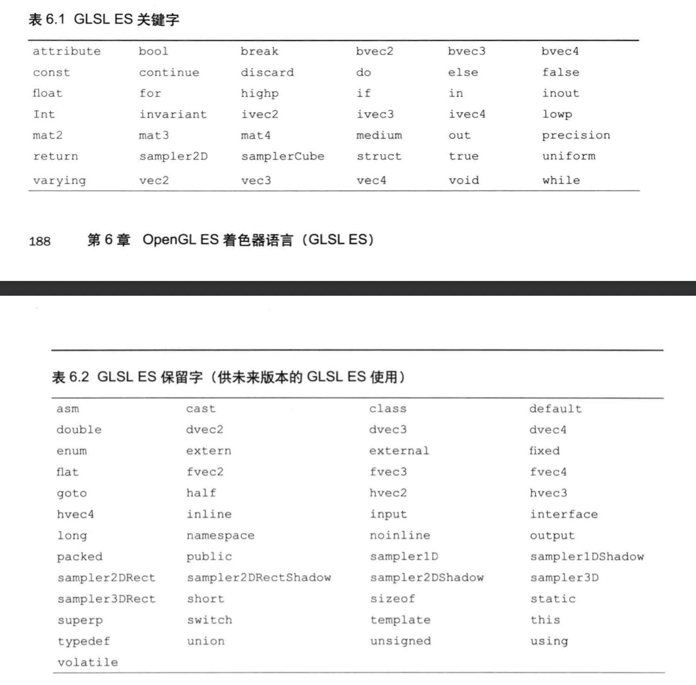
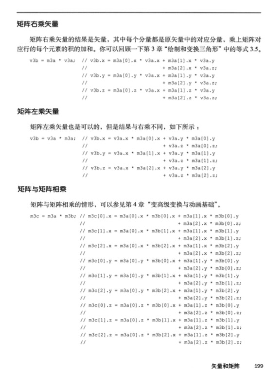
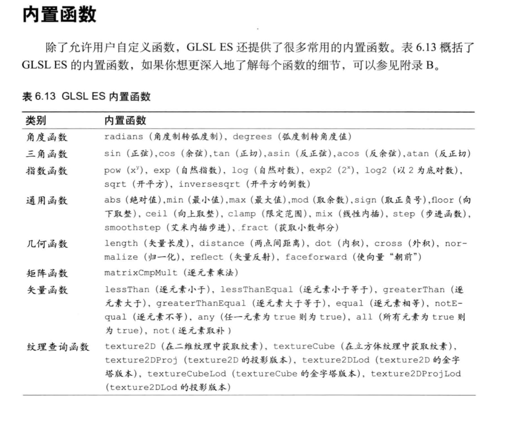
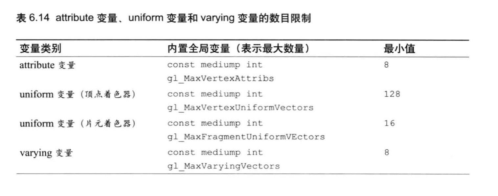
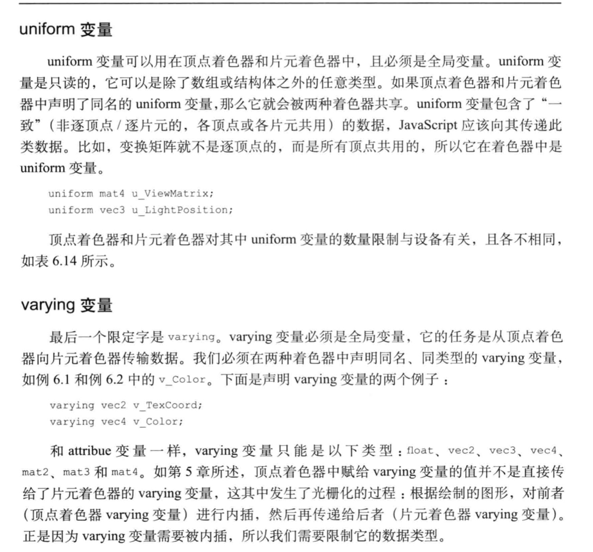

<!--
 * @Author: xiuquanxu
 * @Company: kaochong
 * @Date: 2021-01-21 22:06:31
 * @LastEditors: xiuquanxu
 * @LastEditTime: 2021-01-25 12:51:50
-->
## WebGL、GLSL ES、Open GL  
WebGL并不支持GLSL ES1.00的所有特性。  

GLSL ES编程语言是opengl着色器语言的基础上，删除和简化了一部分功能后形成。   

GLSL ES目标平台是消费电子产品或嵌入式设备，如智能手机或游戏机等，因此简化GLSL ES能够允许硬件厂商对这些设备的硬件进行简化，由此带来好处是降低硬件的功耗，减少性能开销。  

## GLSL ES  

### 类型  

1. 整型、浮点型 
2. 布尔  

不支持字符串  

## 变量  
不能以gl_,webgl_,_webgl_开头  

GLSL ES保留字  

  

## 基本类型  
float  

int   

bool  

## 矢量和矩阵  

### 矢量  
1. vec2、vec3、vec4：具有2-4个浮点数  
2. ivec2、ivec3、ivec4：具有2-4个整数
3. mat2、mat3、mat4：2、3、4的矩阵，分别代表4,9,16的矩阵  

### 矢量函数  
```
vec3 v3 = vec3(1.0, 2.0, 3.0); // 用1.0, 2.0, 3.0初始化v3
vec2 v2 = vec2(v3);// 去v3前两个元素填充v2
vec4 v4 = vec4(1.0); // 用1.0填充v4
```

## 赋值和构造  
矩阵构造函数和赋值
```
<!-- 原矩阵 -->
1.0, 2.0, 3.0, 4.0
5.0, 6.0, 7.0, 8.0,
9.0, 10.0, 11.0, 12.0,
13.0, 14.0, 15.0, 16.0
<!-- 安装列主序 -->
mat4 m4 = mat4(
    1.0, 5.0, 9.0, 13.0,
    2.0, 6.0, 7.0, 8.0,
    ..
    ..
);

<!-- 使用两个vec2创建mat2 -->
vec2 v1 = vec2(1.0, 1.0);
vec2 v2 = vec2(2.0, 2.0);
mat2 m2 = mat2(v1, v2);

<!-- mat4 -->
mat4 m4 = mat4(1.0);
生成m4  
1.0, 0.0, 0.0, 0.0,
0.0, 1.0, 0.0, 0.0,
0.0, 0.0, 1.0, 0.0,
0.0, 0.0, 0.0, 1.0
```

## 访问元素  
```
类比        描述
x,y,z,w    用来获取顶点坐标分量 
r,g,b,z    用来获取颜色分量
s,t,p,q    用来获取纹理坐标分量
```  

## 运算符  

### 矩阵与矢量运算  

  

## 结构体定义、赋值与访问  
```
<!-- 定义 -->
struct light {
    vec4 color;
    vec3 position;
} ll;

l1 = light(vec4(1.0, 0.0, 0.0, 1.0), vec3(1.0, 2.0, 3.0));
vec4 color = l1.color;
```

## 数组  

GLSL ES只支持一维数组，数组对象不支持pop()和push()等操作。
```
<!-- good -->
float floatArr[4];
vec4 vec4Arr[4];

<!-- bad -->
int size = 4;
vec4 vec4Arr[4];

<!-- good -->
const int size = 4;
vec4 vec4Arr[size];
```

## 内置函数  
  

## Attribute变量  
Attribute变量只能声明在顶点着色器中。Attribute变量只能出现在顶点着色器中，只能被声明为全局变量，被用来表示逐顶点信息。attribute变量的类型只能是float、vec2、3、4，mat2、3、4  

## attribute、uniform和varying变量的数目限制  
  

## uniform变量和varying变量  

  

## 精度限定字  

重点  
 