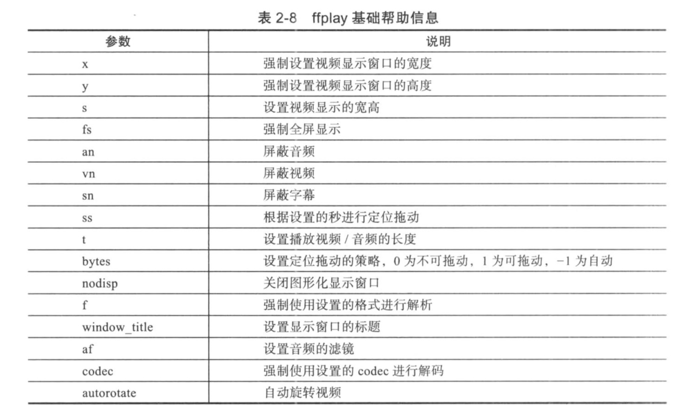

<!--
 * @Author: xiuquanxu
 * @Company: kaochong
 * @Date: 2021-03-31 00:33:58
 * @LastEditors: xiuquanxu
 * @LastEditTime: 2021-05-11 20:04:57
-->
## 2.1 ffmpeg常用命令  
ffmpeg 常用工具：ffmpeg, ffprobe, ffplay分别用作多媒体的编解码工具和内容分析工具和播放器

ffmpeg：编辑码功能  
ffprobe：音视频数据分析，如果分析视频文件流信息、包信息、帧信息  
ffplay: 播放器  

### ffmpeg  
编解码  
```
ffmpeg --help可以看到ffmpeg常见命令  

ffmpeg -decoders // 查看解码支持
ffmpeg -encoders // 查看编码支持
ffmpeg -codec // 查看
ffmpeg -filters // 查看滤镜信息
ffmpeg -h demuxer=flv // 查看对flv解包支持
ffmpeg -h decorder=h264 // 查看对h264解码支持
```

### ffplay使用  
参数:  



### 总结  
- ffmpeg 音视频编解码
- ffprobe 音视频内容
- ffplay 音视频分播放、可视化分析